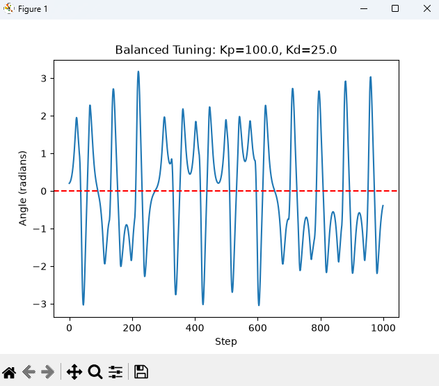
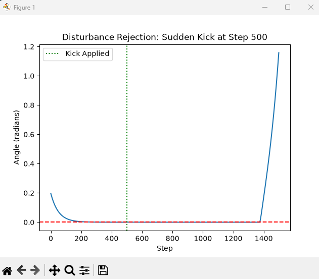
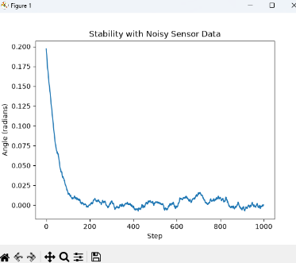

# mujoco-inverted-pendulum
A Proportional-Derivative (PD) control system built with MuJoCo and Python to stabilize an inverted pendulum under noisy and disruptive conditions.
# MuJoCo Inverted Pendulum Stabilization

This project simulates an inverted pendulum on a cart using the **MuJoCo physics engine** and **Python**. My goal was to build a Closed-Loop Feedback system from scratch to balance a structurally unstable object.

## Engineering Challenges
Throughout the development process, I encountered and solved several modeling and control theory challenges:
1. I tried to apply force through code, but this caused my code to crash. This was caused by simply defining joints, and I fixed this by actually modelling the motor in my XML. This allowed my code to have a physical body to work off of.
2. Initially, my pole was offset 0 degrees. However, upon changing this to 0.2 radians, my simulation completely froze. To fix this, I had to implement mujoco.mj_forward(), which forced the engine to recalculate the force and velocities based on my manual placement.
3. Another issue that arose was that my pole would not fall over, even with gravity. I soon identified that the hinge of the pole was located at the pole's center of mass. When I fixed the hinge to be at the bottom of the pole, gravity was able to pull down, therefore resolving my issue.
4. My code caused the system to vibrate violently, causing the erratic oscillations in the  image. I realized that the frame rate on my simulation was too slow, causing my code to overcorrect itself. The problem was solved when I made my code take 500 snapshots per second instead of 100.
5. Initially, I calculated the speed of the pole by using the equation: current_angle - previous_angle. This calculation is incorrect because it relies on the difference between two frames. Therefore, I switched to using data.qvel, which is the MuJoCo physics engine's built-in highly accurate measurement of angular velocity. This issue had caused the cart to push the wrong way.

## Results & Testing
Once the baseline was stable, I stress-tested the controller against real-world scenarios:
1. I simulated a massive "kick" to the pendulum at step 500. The PD controller successfully neutralized the disturbance and returned the system to a 0.0 radian state.

3. To simulate imperfect real-world hardware, I used Gaussian noise (`np.random.normal`) into the angle sensor data. The controller maintained stability despite the jittery inputs.

## How to Run
1. Install dependencies: `pip install mujoco matplotlib numpy`
2. Run the simulation: `python main.py`
